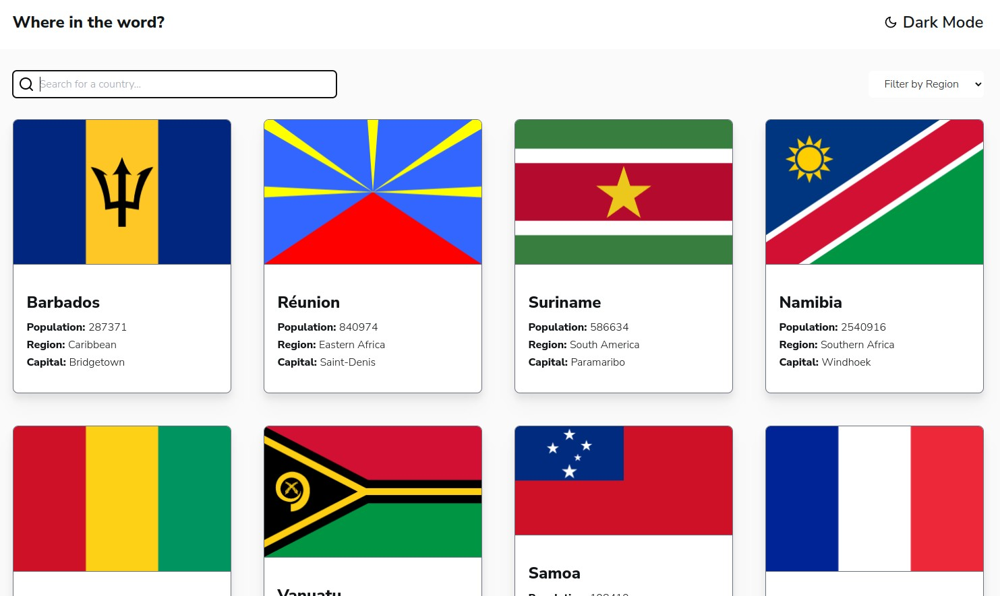
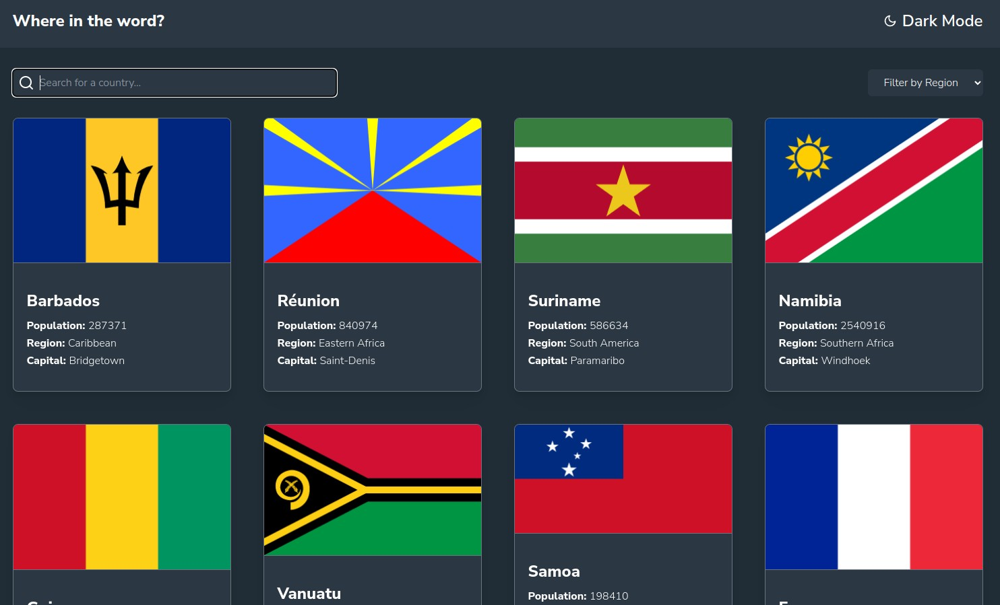
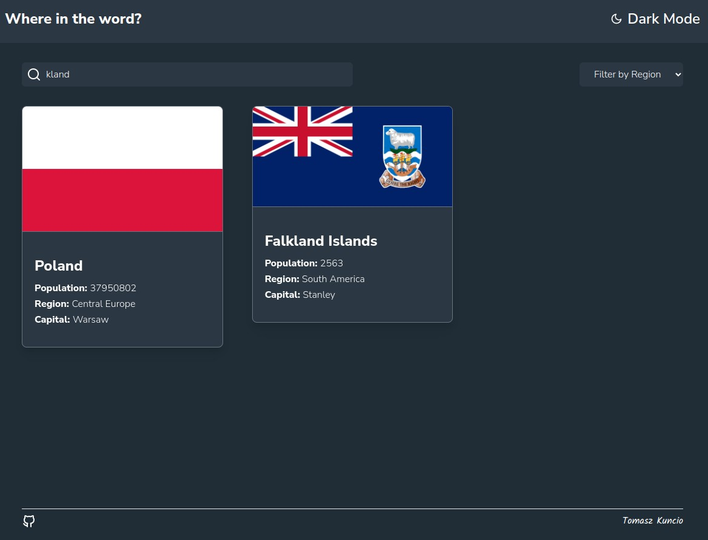
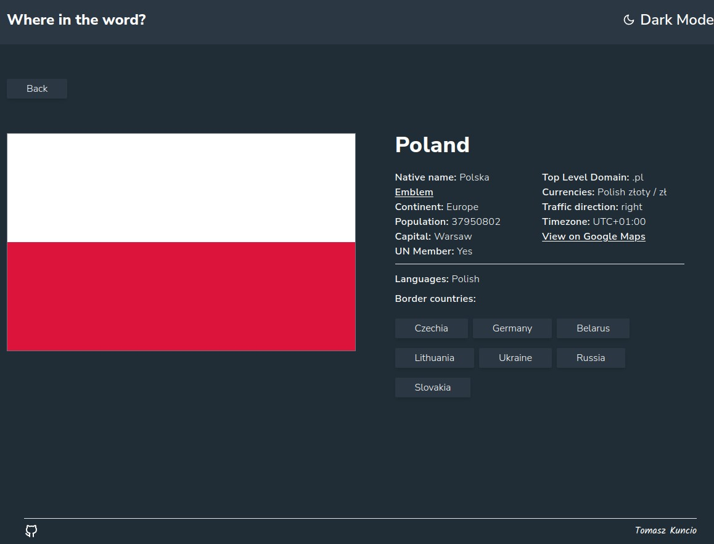

# Frontend Mentor - REST Countries API with color theme switcher

** This is a countries browser app built for coding challenge on Frontend mentor with create-react-app and tailwindcss **

- check out the challenge [Frontend Mentor](https://www.frontendmentor.io/challenges/rest-countries-api-with-color-theme-switcher-5cacc469fec04111f7b848ca )

- checkout my solution [Live Demo](https://qntek.github.io/country-flag-app/)
### Requirement

Users should be able to:

- See all countries from the API on the homepage
- Search for a country using an `input` field
- Filter countries by region
- Click on a country to see more detailed information on a separate page
- Click through to the border countries on the detail page
- Toggle the color scheme between light and dark mode

## Introduction

A simple but stylish dictionary web app built with React, Bootstrap and REST API.

## Screenshots

## 🗝️ Features

- Search for a country lets user to make a typo and still get the correct result thanks to levenshtein distance
- Fetch API using axios if localStored data is older than 7 days
- Apply Global Styles and Theme to manage consistent styling
- Toggle switch to change between dark/light mode
- Once used color theme is remembered using localStorage
- Completely responsive 🙌

## 🛠 Technologies

- React
- Tailwindcss
- React Spinners
- Axios
